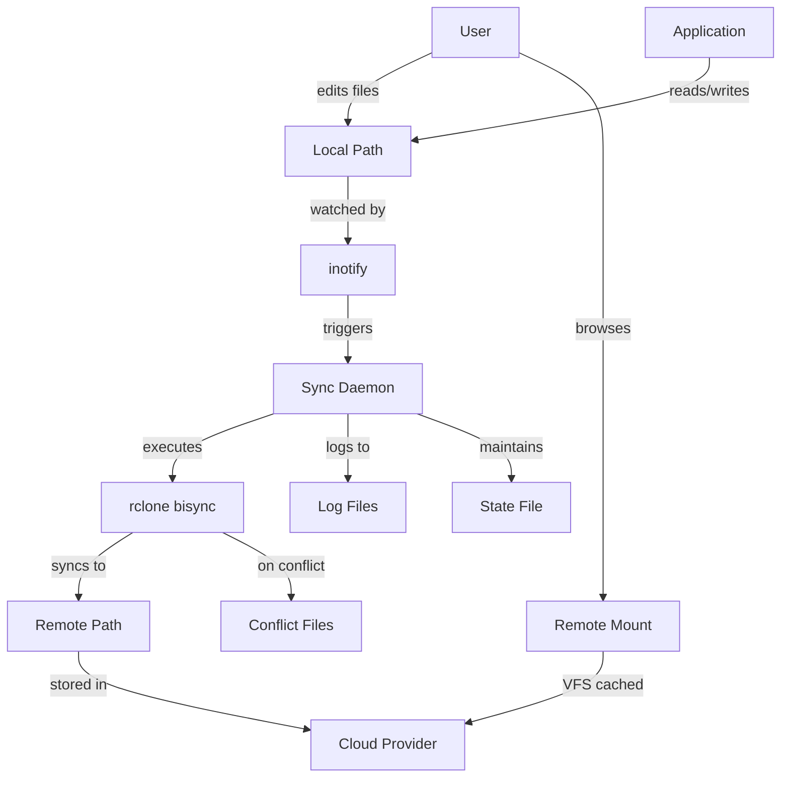
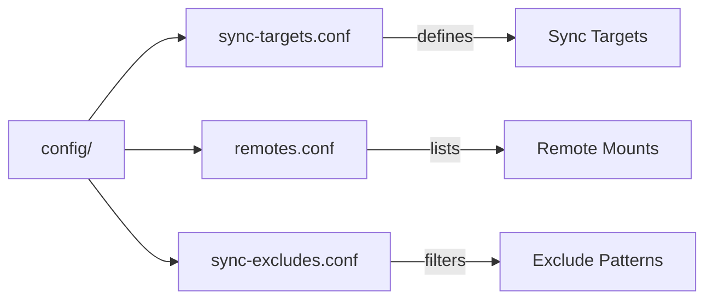
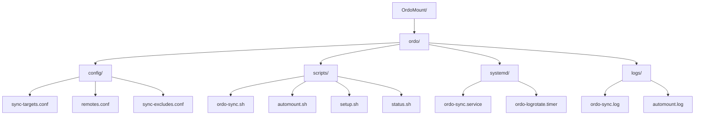

# OrdoMount System Architecture - ERD

```mermaid
erDiagram
    ORDO_SYSTEM ||--o{ SYNC_TARGET : manages
    ORDO_SYSTEM ||--o{ REMOTE_MOUNT : manages
    ORDO_SYSTEM ||--o{ LOG_FILE : generates
    ORDO_SYSTEM ||--|| SYNC_DAEMON : runs
    
    SYNC_TARGET ||--|| LOCAL_PATH : syncs_from
    SYNC_TARGET ||--|| REMOTE_PATH : syncs_to
    SYNC_TARGET ||--o{ CONFLICT : may_have
    SYNC_TARGET ||--|| RCLONE_BISYNC : uses
    
    REMOTE_MOUNT ||--|| RCLONE_REMOTE : mounts
    REMOTE_MOUNT ||--|| MOUNT_POINT : creates_at
    
    RCLONE_REMOTE ||--o{ REMOTE_PATH : contains
    RCLONE_REMOTE ||--|| CLOUD_PROVIDER : connects_to
    
    APPLICATION ||--|| LOCAL_PATH : reads_writes
    USER ||--|| REMOTE_MOUNT : browses
    USER ||--|| APPLICATION : uses
    
    SYNC_DAEMON ||--|| INOTIFY_WATCH : monitors_with
    SYNC_DAEMON ||--|| STATE_FILE : maintains
    
    ORDO_SYSTEM {
        string version "1.0"
        string base_dir "/path/to/ordo"
        string log_dir "logs/"
        string config_dir "config/"
        string conflict_dir "conflicts/"
    }
    
    SYNC_TARGET {
        string local_path "~/Documents/Project"
        string remote_path "remote:path"
        int sync_frequency_seconds "300"
        string rclone_flags "--optional-flags"
        timestamp last_sync "2025-12-16 10:30:00"
        string status "synced|syncing|error"
    }
    
    LOCAL_PATH {
        string absolute_path "~/Documents/Project"
        boolean exists "true"
        string marker_file ".rclone-bisync-state"
        timestamp last_modified "2025-12-16 10:30:00"
    }
    
    REMOTE_PATH {
        string rclone_syntax "remote:path/to/folder"
        string remote_name "onedrive-f6388"
        string cloud_path "Documents/Project"
        boolean accessible "true"
    }
    
    REMOTE_MOUNT {
        string remote_name "onedrive-f6388"
        string mount_point "/media/user/onedrive-f6388"
        string mount_suffix "optional"
        string rclone_flags "VFS cache flags"
        boolean is_mounted "true"
    }
    
    RCLONE_REMOTE {
        string name "onedrive-f6388"
        string type "onedrive|gdrive|s3"
        string auth_token "encrypted"
        boolean configured "true"
    }
    
    MOUNT_POINT {
        string path "/media/$USER/remote"
        boolean exists "true"
        string permissions "755"
    }
    
    CLOUD_PROVIDER {
        string name "OneDrive|GoogleDrive|S3"
        string api_endpoint "https://api.provider.com"
        boolean online "true"
    }
    
    RCLONE_BISYNC {
        string command "rclone bisync"
        string filters_file "sync-excludes.conf"
        string conflict_policy "newer wins"
        boolean resync_mode "false"
        int retries "3"
    }
    
    CONFLICT {
        string local_file "file.conflict1.txt"
        string remote_file "file.conflict2.txt"
        timestamp detected_at "2025-12-16 10:30:00"
        string resolution "manual|auto"
    }
    
    SYNC_DAEMON {
        int pid "12345"
        string mode "daemon"
        int poll_interval "60-120 seconds"
        boolean running "true"
        timestamp started_at "2025-12-16 08:00:00"
    }
    
    INOTIFY_WATCH {
        string watched_path "~/Documents/Project"
        string events "modify|create|delete"
        boolean active "true"
    }
    
    STATE_FILE {
        string path ".cache/ordo/sync/daemon.state"
        timestamp updated_at "2025-12-16 10:30:00"
        string daemon_status "running"
        json last_run_info "{}"
    }
    
    LOG_FILE {
        string type "sync|mount|system"
        string path "logs/ordo-sync.log"
        timestamp created_at "2025-12-16 08:00:00"
        int size_bytes "1048576"
    }
    
    APPLICATION {
        string name "Obsidian|VSCode|Git"
        string working_path "~/Documents/Project"
        boolean offline_capable "true"
    }
    
    USER {
        string username "fabio"
        string home_dir "/home/fabio"
        boolean online "true"
    }
```

## System Architecture Overview

### Core Components

1. **ORDO_SYSTEM**: Main orchestrator managing sync and mount operations
2. **SYNC_TARGET**: Bidirectional sync configuration between local and remote paths
3. **REMOTE_MOUNT**: Read-only browsing mounts for exploring cloud storage
4. **SYNC_DAEMON**: Background process monitoring and syncing changes

### Data Flow

### Key Relationships

- **Applications → Local Paths**: Apps work with local files only (offline-capable)
- **Sync Targets → rclone bisync**: Bidirectional synchronization with conflict detection
- **Remote Mounts → VFS**: Read-only browsing of entire cloud storage
- **Daemon → inotify**: File change monitoring for immediate sync triggers
- **Conflicts**: Timestamped copies when both sides modified

### Configuration Files

### Directory Structure Entity

## Entity Descriptions

### ORDO_SYSTEM
Central orchestration system managing all sync and mount operations.

### SYNC_TARGET
Represents a bidirectional sync relationship between a local directory and remote cloud path. Applications point to the local path.

### LOCAL_PATH
Physical local directory on the filesystem where applications read/write files. Always available offline.

### REMOTE_PATH
Cloud storage location referenced using rclone remote syntax (e.g., `onedrive:Documents/`).

### REMOTE_MOUNT
Optional browsing mount that provides read-only access to entire cloud storage at `/media/$USER/remote-name/`.

### RCLONE_REMOTE
Configured rclone remote connection to a cloud provider (OneDrive, Google Drive, S3, etc.).

### CLOUD_PROVIDER
External cloud storage service (Microsoft OneDrive, Google Drive, AWS S3, etc.).

### RCLONE_BISYNC
rclone's bidirectional sync engine that handles conflict detection and resolution.

### CONFLICT
Files that were modified on both local and remote sides between syncs, stored with timestamped names.

### SYNC_DAEMON
Background process that monitors file changes and periodically syncs all configured targets.

### INOTIFY_WATCH
Linux filesystem event monitoring for immediate sync triggers on local file changes.

### STATE_FILE
Runtime state tracking for daemon health monitoring and last sync information.

### LOG_FILE
Rotating log files tracking sync operations, mount status, and system events.

### APPLICATION
User applications (Obsidian, VSCode, Git, etc.) that work with local paths exclusively.

### USER
System user who configures and uses OrdoMount for their cloud storage needs.

## Design Principles

1. **Local-First**: Applications always work with local files
2. **Background Sync**: Transparent synchronization without app interference
3. **Conflict Detection**: Automatic detection with timestamped conflict copies
4. **Offline Capable**: Full functionality without network connection
5. **Zero Crashes**: Network issues never affect applications
6. **Browse Separately**: Optional remote mounts for exploring cloud storage
